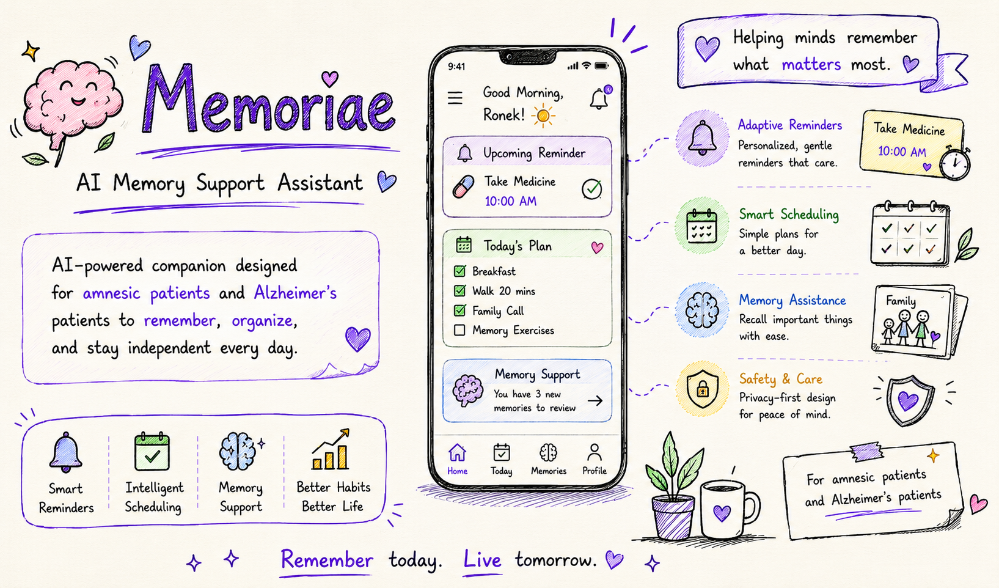
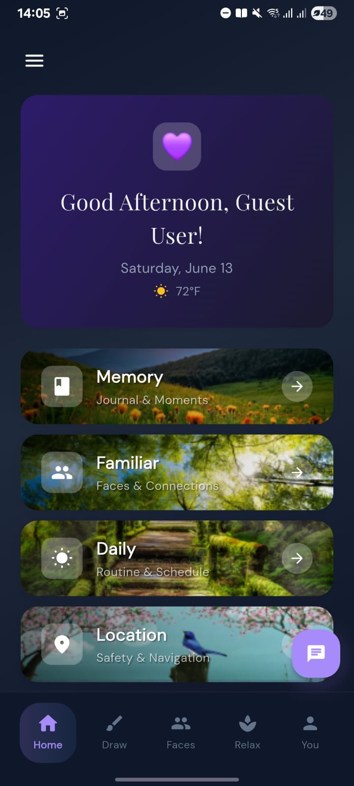
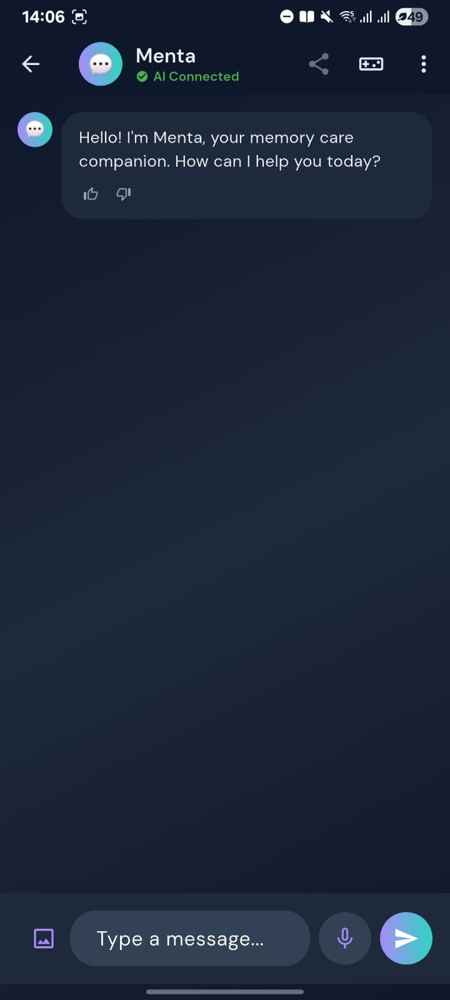
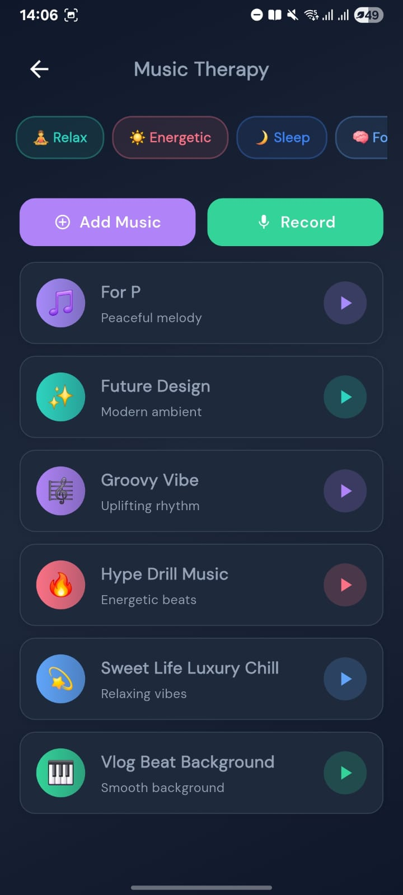
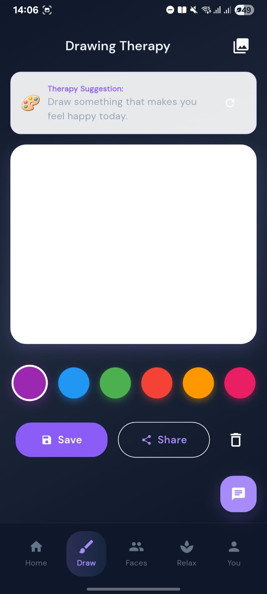
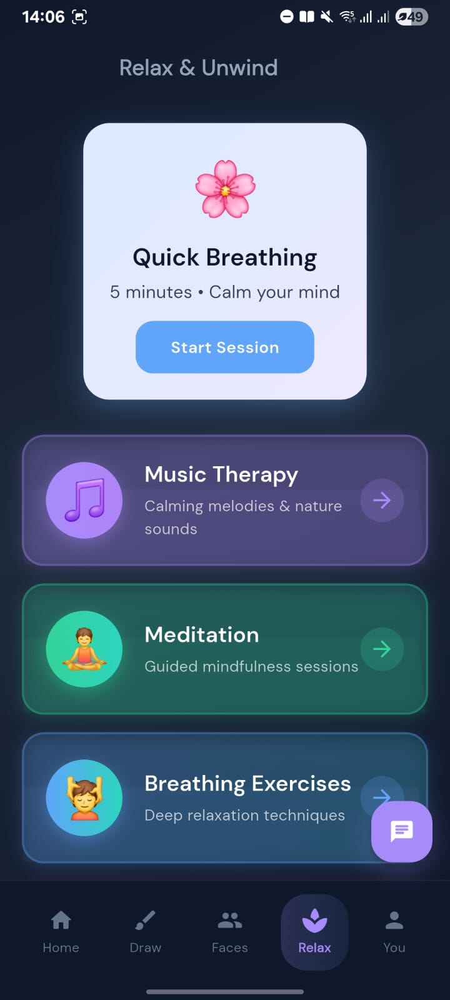
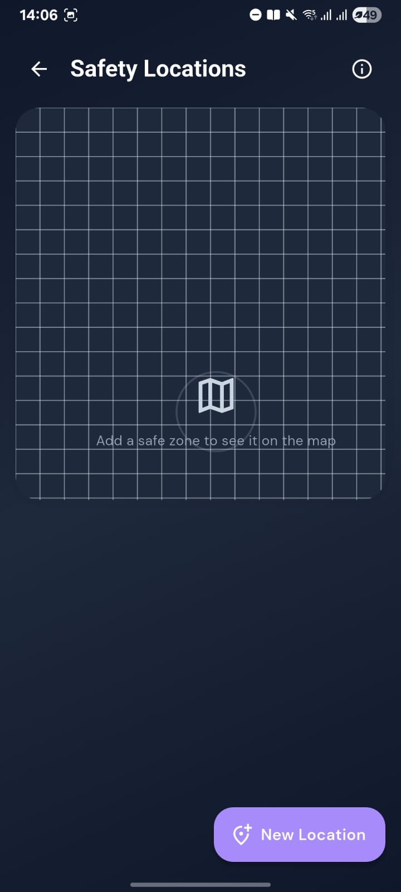
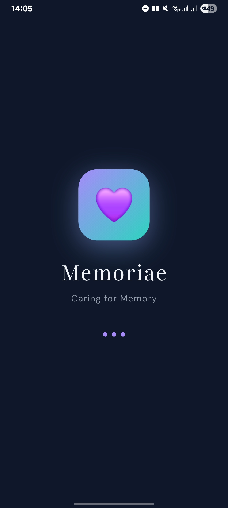
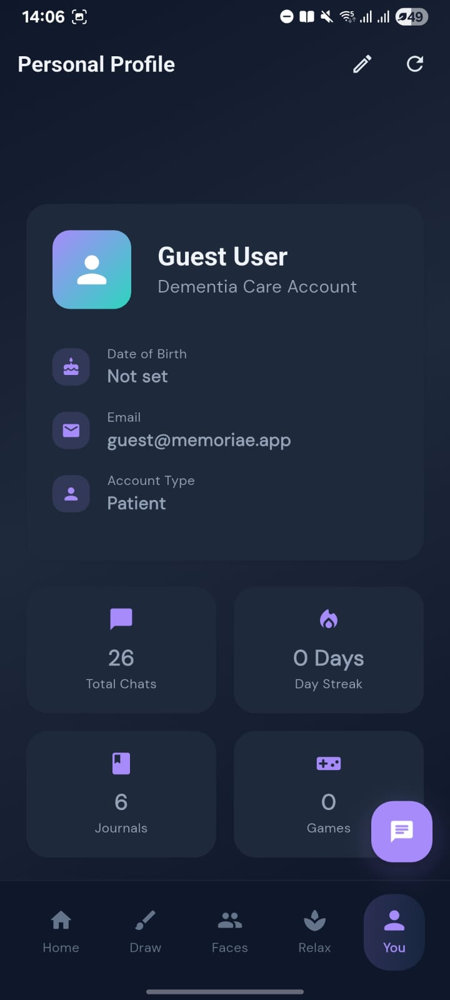

<p align="center">
  
</p>

<p align="center">
  <strong>A privacy-first AI companion for people living with dementia and their caregivers.</strong><br/>
  Built with Flutter · Powered by Gemini · Secured with SQLCipher
</p>

<p align="center">
  <a href="https://flutter.dev"></a>
  <a href="https://dart.dev"></a>
  <a href="https://ai.google.dev"></a>
  <a href="https://www.zetetic.net/sqlcipher"></a>
  <a href="LICENSE"></a>
</p>

<p align="center">
  <a href="docs/memdemo1.mp4">▶️ Watch the Demo</a> &nbsp;·&nbsp;
  <a href="docs/ARCHITECTURE.md">Architecture</a> &nbsp;·&nbsp;
  <a href="docs/SECURITY.md">Security</a> &nbsp;·&nbsp;
  <a href="docs/guides/QUICK_START.md">Quick Start</a>
</p>

---

## What is Menta?

Menta is a dedicated mobile companion for individuals living with **dementia or cognitive impairment**, and the caregivers who support them. It replaces scattered paper notes, missed medication alerts, and family photo albums with a single calm, accessible interface — all secured on-device with no cloud account required.

At its core is **Menta**, a conversational AI assistant powered by Google Gemini that has access to the patient's own journals, routines, medications, and familiar faces — so it can answer questions like *"What did I do on Tuesday?"* or *"Who is the woman in my photos?"* with context drawn directly from the patient's own life.

> 📄 **This project was submitted to ICSRC 2026.** See [`docs/MEMORIAE_ICSRC2026_Final.docx`](docs/MEMORIAE_ICSRC2026_Final.docx) for the full research paper.

---

## Screenshots

<table>
  <tr>
    <td align="center"><b>Dashboard</b></td>
    <td align="center"><b>Menta AI Chat</b></td>
    <td align="center"><b>Familiar Faces</b></td>
  </tr>
  <tr>
    <td></td>
    <td></td>
    <td></td>
  </tr>
  <tr>
    <td align="center"><b>Music Therapy</b></td>
    <td align="center"><b>Drawing Therapy</b></td>
    <td align="center"><b>Meditation</b></td>
  </tr>
  <tr>
    <td></td>
    <td></td>
    <td></td>
  </tr>
  <tr>
    <td align="center"><b>Safety / Lost Mode</b></td>
    <td align="center"><b>Biometric Auth</b></td>
    <td align="center"><b>Accessibility</b></td>
  </tr>
  <tr>
    <td></td>
    <td></td>
    <td></td>
  </tr>
</table>

---

## Features

### 💬 Menta AI Assistant
Context-aware conversational AI powered by **Google Gemini** via direct REST integration. Menta dynamically injects the patient's own journals, routines, medications, and family data into every prompt — so responses are personal, not generic. Implements multi-endpoint fallback (`gemini-flash` → `gemini-2.0-flash` → `gemini-2.5-flash`) with explicit retry and timeout handling. Full conversation history is persisted in the encrypted local database.

### 🧠 Memory Journal
Rich daily journaling with **photo attachments**, **voice recordings**, mood tracking, and tag-based search. All entries stored in an AES-256 encrypted SQLite database, never in the cloud.

### 👥 Familiar Faces
A curated photo directory of caregivers, family members, and friends with relationship labels. Helps users maintain social orientation and gives Menta the context to answer face-recognition questions conversationally.

### 💊 Medication Manager
Full CRUD medication schedules with **local push notifications** for dose reminders and refill alerts. Tracks full dose history with timestamps.

### 📅 Daily Routines
Configurable morning and evening routines with per-task completion tracking and notification reminders.

### 🎵 Music Therapy
Curated therapeutic playlist playback. Music selected to evoke positive memories and reduce anxiety.

### 🎨 Drawing Therapy
Free-form canvas with a colour palette and save-to-gallery. A low-barrier creative outlet accessible with one tap.

### 🧘 Relaxation Hub
Single entry point for guided meditation, breathing exercises, music therapy, and art therapy.

### 📍 Safety & Lost Mode
Geofenced safe-zone management with caregiver alert integration. Surfaces a simplified "I am lost" emergency screen with one tap.

### 🧩 Memory Games
Face-matching cognitive stimulation mini-games with progress tracking.

### 🔒 Authentication & Security
PIN and biometric authentication, encrypted SQLite via SQLCipher, field-level AES encryption, and a full audit log of sensitive operations.

### 👨‍👩‍👧 Caregiver Mode
Dedicated caregiver screens for monitoring activity, reviewing audit logs, and configuring alerts.

---

## Tech Stack

| Layer | Technology |
|---|---|
| Framework | Flutter 3.x / Dart 3.9+ |
| State Management | Provider |
| Local Database | sqflite_sqlcipher (AES-256 encrypted SQLite) |
| AI | Google Gemini API — direct REST via `http` (no SDK overhead) |
| Notifications | flutter_local_notifications + timezone |
| Media | audioplayers, record, image_picker |
| Security | flutter_secure_storage, local_auth, encrypt |
| Accessibility | flutter_tts, speech_to_text, semantic labels |

---

## Architecture

```
┌─────────────────────────────────────────────────┐
│                   Screens                        │  ← Pure UI, zero business logic
├─────────────────────────────────────────────────┤
│                  Providers                       │  ← Reactive state (Provider)
├─────────────────────────────────────────────────┤
│                  Services                        │  ← All I/O and business logic
├──────────────┬──────────────┬────────────────────┤
│  SQLCipher   │  Gemini API  │   Device APIs      │
│  (encrypted  │  (REST/http) │  (notifications,   │
│   SQLite)    │              │   audio, auth)     │
└──────────────┴──────────────┴────────────────────┘
```

Services are singletons wired via Provider at startup in `main.dart`. Screens access services exclusively through `Provider.of<T>(context)` — no direct instantiation in widgets. The `GeminiService` uses `package:http` directly rather than `package:google_generative_ai`, giving full control over model selection, retry strategy, and timeout handling.

→ Full details in [docs/ARCHITECTURE.md](docs/ARCHITECTURE.md)

---

## Security

| Layer | Implementation |
|---|---|
| Device auth | PIN + biometric via `local_auth` on every launch |
| Database | SQLCipher AES-256 full-database encryption |
| Field encryption | AES via `encrypt` package for sensitive text fields |
| Key storage | Android Keystore / iOS Keychain via `flutter_secure_storage` |
| API credentials | Never compiled in — runtime entry, stored in secure storage |
| Audit trail | `AuditLoggingService` — tamper-evident log of all sensitive operations |
| Data export | Encrypted JSON for clinical caregiver handover |
| Network | HTTPS only; no analytics or telemetry leaves the device |

→ Full policy in [docs/SECURITY.md](docs/SECURITY.md)

---

## Getting Started

### Prerequisites
- Flutter SDK ≥ 3.0 ([install](https://docs.flutter.dev/get-started/install))
- Dart SDK ≥ 3.9
- A [Google Gemini API key](https://aistudio.google.com/app/apikey) (free tier available)

### 1. Clone
```bash
git clone https://github.com/midnightchaos/memoriae.git
cd memoriae
```

### 2. Install dependencies
```bash
flutter pub get
```

### 3. Configure your API key

Create `lib/config/env_config.dart` (gitignored — never commit this file):

```dart
class EnvConfig {
  static const String geminiApiKey = 'YOUR_API_KEY_HERE';
  static bool get hasDefaultApiKey => geminiApiKey.isNotEmpty;
}
```

> The key can also be entered at runtime via the Settings screen and is stored in `flutter_secure_storage` — never compiled into the binary.

### 4. Run
```bash
flutter run
```

→ [docs/guides/QUICK_START.md](docs/guides/QUICK_START.md) for platform-specific notes.

---

## Testing

```bash
flutter test            # all tests
flutter test --coverage # with coverage report
```

→ [docs/guides/TESTING_GUIDE.md](docs/guides/TESTING_GUIDE.md) for the full guide.

---

## Research

This project was developed alongside a formal research study submitted to the **International Conference on Systems Research and Computing (ICSRC) 2026**, covering system architecture, AI integration design decisions, accessibility evaluation, and comparative analysis against existing dementia care applications.

→ [MEMORIAE_ICSRC2026_Final.docx](docs/MEMORIAE_ICSRC2026_Final.docx)

---

## Roadmap

- [ ] GitHub Actions CI pipeline
- [ ] Expanded unit and widget test coverage  
- [ ] Caregiver remote monitoring dashboard
- [ ] End-to-end encrypted caregiver ↔ patient sync
- [ ] Photo memory timeline view
- [ ] Offline speech-to-text for journal dictation
- [ ] Accessibility audit (WCAG 2.1 AA target)

---

## Contributing

1. Fork and branch from `main`
2. Follow existing service/screen patterns — screens contain no business logic
3. Add tests for any new service methods
4. Keep all API keys out of source — use `env_config.dart`

→ [CONTRIBUTING.md](CONTRIBUTING.md) for full guidelines.

---

## License

MIT © Menta Contributors